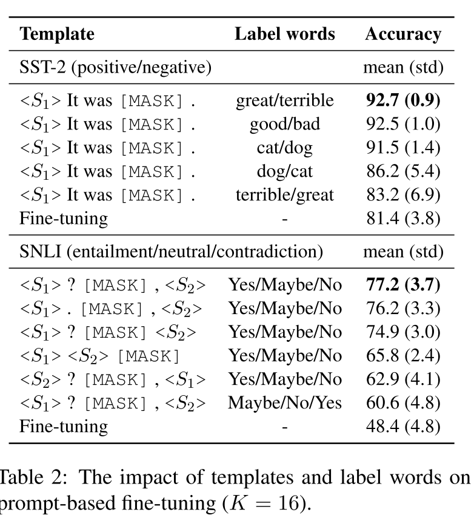
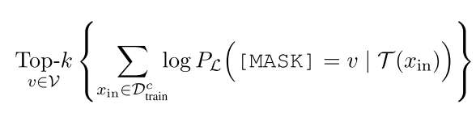
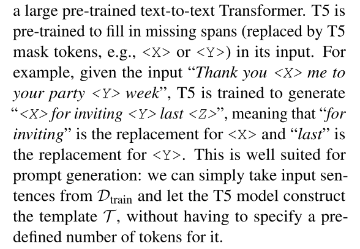
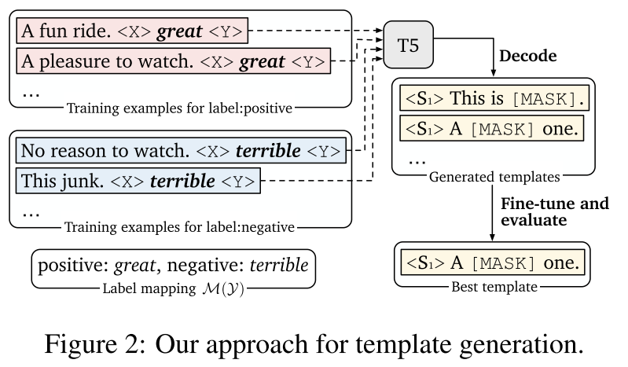
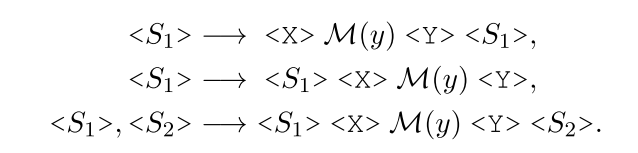
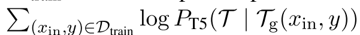
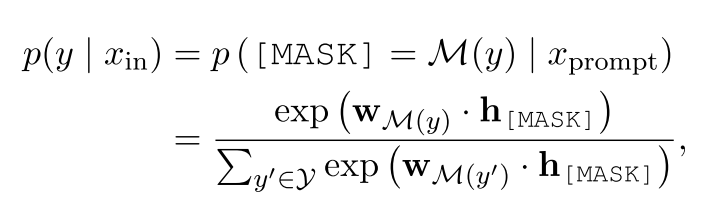

# Making Pre-trained Language Models Better Few-shot Learners (LM-BFF)
approach: 
1. 自动模板生成
2. demonstrations的选择

把GPT3的方法迁移到bert等中等规模的预训练模型

## 自动模板生成
best label words: 剪枝暴力搜索  
templates: T5 生成
***
### 模板构建
根据

table2

* template 固定时，label words 越接近真实语义越好
* template 对[mask]的位置敏感

### 自动选择label words
暴力搜索
对于类别C，在训练集上进行zero-shot，找出概率最大的top n个词，再在验证集上微调，找出效果最好的 top k个词。

### 自动生成tempaltes
**T5** 不同于一般的填空，可以填入不定长度的短语

作者搞了三种形式的词槽位置，送入T5填充

目的是优化这个式子，选取生成概率比较大的模板

然后在验证集上fine-tuning，找到效果最好的模板
***
## demonstrations
GPT-3 **随机选取**32个example，加到input

作者认为 demonstrations 的要求（GPT3的不足）:
* informative
* not too long to learn

strategy:
> 对于每个输入，从每个class中,从中找出和inputs语义最接近的，随机采样一条，作为demonstration候选集，使得模型更有对比度的比较（假设demonstrations和inputs越接近，模型越能从比较中学到东西)

采用SBERT 判断句子相似度
***
## prompt-based fine-tuning
$X_{prompt}$ = [CLS] $x_1$ It was [MASK].[SEP]
PTM决定[MASK]更适合填入哪一次label word
### classification
把 $H_{mask}$ 输入一个全连接层，通过softmax求出预测词的概率

公式

### regression
把label space 视为 数值区间

## evaluate
8 single-sentence and 7 sentence-pair NLP tasks

