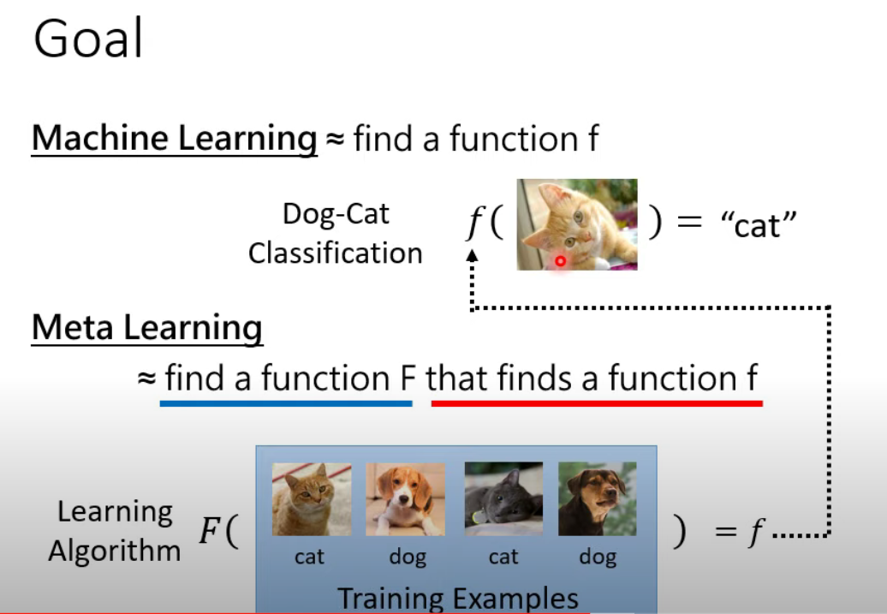

## 元学习 meta-learning
“learning to learn” 通过基于实验结果来提升学习算法的表现。
输入为 一堆训练任务， 输出为 适用于few-shot的算法模型
分为training task 和 test task，分别都有训练资料和测试资料。training task中的训练资料叫做support set，测试资料叫做query set
> with-in task 每个任务内部训练
cross-task task 综合所有任务的loss更新参数
不同任务可以视为不同的domain，所以元学习可以理解成domain adaptation 或者 transfer learning

一般跟多任务学习结合，在多种任务上训练模型，从而用很少的训练样本就能解决新任务

一些任务：
  * observing the performance of different machine learning models about learning tasks
  * learning from meta data
  * performing faster learning process for new tasks

一些方法：

1. Metric Learning
2. Model-Agnostic Meta-learning(MAML) 模型无关的元学习：训练模型的初始化参数，使得在新任务上需要很少的update

MAML认为：few-shot work的原因，可以认为是学习开始时，模型的参数就形成了可适用于多种任务的内在表示。